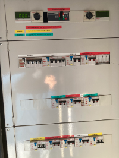
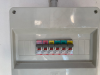

## Pagina per le proiezioni da PC

Quadro Elettrico Grande


Quadro Elettrico Piccolo


Tirar su tutti gli interruttori gialli del quadro elettrico grande
Per proiettare ddPC su anche tutti interruttori verdi
Chiudere quadro grande
Tirar su tutti gialli e verdi nel quadretto piccolo

accendi pc con interruttore a muro

accendere schermo macchina con la pennina

accendere NAS QNAP con piccolo interruttore sul fronte a destra (attendere circa 4 min tutte luci verdi, fa bip dopo 5 secondi e un altro bip dopo 5  min)

accendere SCALER

cliccare su icona per accendere macchina (sembra disattivata come da foto)
attendere che finisca messaggio "Starting DLP/IMB"

Accendere intanto due amplificatori CROWN per audio

Accendere mixer audio dentro l'armadietto (se servono anche i microfoni accendere anche phantom power)

Accendere light e togliere il tappo (senza girarlo)
Controllare che douser sia acceso

Prendere cavo HDMI dal cassetto in alto a sinistra
Attaccare a dispositivo e a HDMI-1 sul muro a sinistra
Premere bottone HDMI-1 sullo SCALER
Premere bottone SCALER video sullo schermo del proiettore
! nel caso non funzioni HDMI attaccare direttamente dietro allo SCALER

Audio
Prendere cavo rosso da casssettino in alto a sx
Attaccare jack piccolo a dospositivo
Attaccare 2 jack più grandi a LINE dei canali 15 e 16
Premere pulsanti LINE -20 dB
più in basso premere i due ON con lucina verde
premere i due pulsanti L-R
Alzare le manopoline bianche a circa 2/3
alzare le manopoline crema nel mixer sulla destra in basso fino al 10 circa


You can use the [editor on GitHub](https://github.com/ctslb/cine/edit/gh-pages/index.md) to maintain and preview the content for your website in Markdown files.

Whenever you commit to this repository, GitHub Pages will run [Jekyll](https://jekyllrb.com/) to rebuild the pages in your site, from the content in your Markdown files.

### Markdown

Markdown is a lightweight and easy-to-use syntax for styling your writing. It includes conventions for

```markdown
Syntax highlighted code block

# Header 1
## Header 2
### Header 3

- Bulleted
- List

1. Numbered
2. List

**Bold** and _Italic_ and `Code` text

[Link](url) and 
```

For more details see [GitHub Flavored Markdown](https://guides.github.com/features/mastering-markdown/).

### Jekyll Themes

Your Pages site will use the layout and styles from the Jekyll theme you have selected in your [repository settings](https://github.com/ctslb/cine/settings/pages). The name of this theme is saved in the Jekyll `_config.yml` configuration file.
